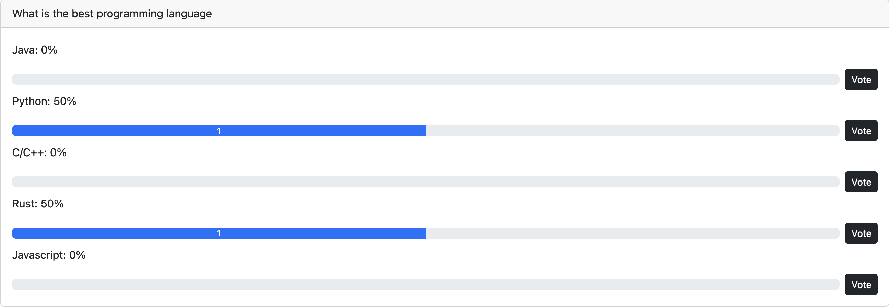

# decentralized-voting-ethereum

## Simple Decentralised Voting App with Ethereum Solidity

The project demonstrates a siimple decentralised voting use case. An administrator uploads a voting configuration iinto Pinata and creates a poll pointing to the Pinata URI. A ethereum account registers (becomes a membber) and cast their votes in the options provided.

## Installation & Workfllow:

### Installation

0. Install NodeJS
1. Clone this repo
2. `cd decentralised-voting`
3. Run the following commands inside the frontend and backend folders:
   1. npm install --save-dev
4. Create an account at https://pinata.cloud/
   5 .Upload file `vote1.json`` in this repo to Pinata persistence storage IPFS (copy and save the URI - you will need in the workflow stage)

### Backend setup

0. Ensure the contract has been properly setup and works correctly by running `npx hardhat test`
1. Deploy contract with:
   1. `npx hardhat node --hostname 127.0.0.1`
   2. `npx hardhat run ./scripts/deploy.js --network localhost`

### Frontend setup

1. `cd frontend`
2. `npm install`
3. `npm start`

### Decentralised Voting

1. Browse to your application (e.g. http://localhost:3000)
   
2. Reset your metamask accounts if existing for the app site
3. Connect metamask account (Connect to Metamask button will disappear)
     
4. Become a voting member (Become member button will disappear)
    

5. Create a poll:
    -> 
6. Few seconds after creating the poll in 5, goto @Vote
   
7. Vote (account 1)
   

8. Vote (account 2)
   

### Known Bugs

1. A third account cannot vote
